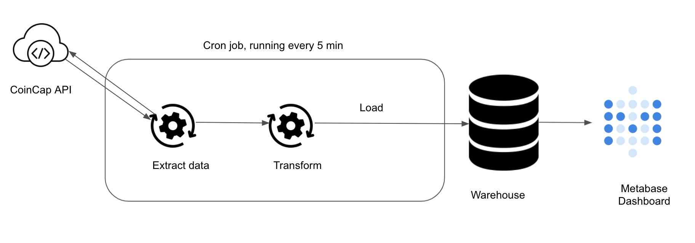

* [DOGE Coin Monitor](#bitcoin-monitor)
    * [Run locally](#run-locally)
    * [Architecture](#architecture)

# Bitcoin Monitor

This is an ETL pipeline to pull DOGE coin data from [CoinCap API](https://docs.coincap.io/) and load it into a warehouse. 

### Run locally

To run locally, you need:

1. [git](https://git-scm.com/book/en/v2/Getting-Started-Installing-Git)
2. [Github account](https://github.com/)
3. [Docker](https://docs.docker.com/engine/install/) with at least 4GB of RAM and [Docker Compose](https://docs.docker.com/compose/install/) v1.27.0 or later

Clone the repo and run the following commands to start the data pipeline:

```bash
git clone https://github.com/raghunandan-r/DOGECoinMonitor.git
cd bitcoinMonitor
make up
sleep 30 # wait for Metabase to start
make ci # run checks and tests
```
Go to [http:localhost:3000](http:localhost:3000) to see the Metabase UI.


## 1 . ETL Code
The code to pull data from CoinCap API and load it into the warehouse is at exchange_data_etl.py . In this script we

1. Pull data from CoinCap API using the get_exchange_data function.
2. Use get_utc_from_unix_time function to get UTC based date time from unix time(in ms).
3. Load data into our warehouse using the _get_exchange_insert_query insert query.

```python
def run() -> None:
    data = get_exchange_data()
    for d in data:
        d['update_dt'] = get_utc_from_unix_time(d.get('updated'))
    with WarehouseConnection(**get_warehouse_creds()).managed_cursor() as curr:
        p.execute_batch(curr, _get_exchange_insert_query(), data)
```

There are a few things going on at “with WarehouseConnection(**get_warehouse_creds()).managed_cursor() as curr:".

We use the get_warehouse_creds utility function to get the warehouse connection credentials.
The warehouse connection credentials are stored as environment variables within our docker compose definition. The docker-compose uses the hardcoded values from the env file.
The credentials are passed as **kwargs to the WarehouseConnection class.
The WarehouseConnection class uses contextmanager to enable opening and closing the DB connections easier. This lets us access the DB connection without having to write boilerplate code.

```python
def get_warehouse_creds() -> Dict[str, Optional[Union[str, int]]]:
    return {
        'user': os.getenv('WAREHOUSE_USER'),
        'password': os.getenv('WAREHOUSE_PASSWORD'),
        'db': os.getenv('WAREHOUSE_DB'),
        'host': os.getenv('WAREHOUSE_HOST'),
        'port': int(os.getenv('WAREHOUSE_PORT', 5432)),
    }
class WarehouseConnection:
    def __init__(
        self, db: str, user: str, password: str, host: str, port: int
    ):
        self.conn_url = f'postgresql://{user}:{password}@{host}:{port}/{db}'

    @contextmanager
    def managed_cursor(self, cursor_factory=None):
        self.conn = psycopg2.connect(self.conn_url)
        self.conn.autocommit = True
        self.curr = self.conn.cursor(cursor_factory=cursor_factory)
        try:
            yield self.curr
        finally:
            self.curr.close()
            self.conn.close()
```

## 2. Test

In this example, I add 2 major types of tests.

- Unit test: To test if individual functions are working as expected. I test get_utc_from_unix_time with the test_get_utc_from_unix_time function.
- Integration test: To test if multiple systems work together as expected.


Mock the Coinbase API call using the mocker functionality of the pytest-mock library. I use fixture data at test/fixtures/sample_raw_exchange_data.csv as a result of an API call. This is to enable deterministic testing.
Assert that the data stored in the warehouse is the same as expected.

Finally the teardown_method truncates the local warehouse table. This is automatically called by pytest after the test_covid_stats_etl_run test function is run.

```python
class TestBitcoinMonitor:
    def teardown_method(self, test_covid_stats_etl_run):
        with WarehouseConnection(
            **get_warehouse_creds()
        ).managed_cursor() as curr:
            curr.execute("TRUNCATE TABLE bitcoin.exchange;")

    def get_exchange_data(self):
        with WarehouseConnection(**get_warehouse_creds()).managed_cursor(
            cursor_factory=psycopg2.extras.DictCursor
        ) as curr:
            curr.execute(
                '''SELECT id,
                        name,
                        rank,
                        percenttotalvolume,
                        volumeusd,
                        tradingpairs,
                        socket,
                        exchangeurl,
                        updated_unix_millis,
                        updated_utc
                        FROM bitcoin.exchange;'''
            )
            table_data = [dict(r) for r in curr.fetchall()]
        return table_data

    def test_covid_stats_etl_run(self, mocker):
        mocker.patch(
            'bitcoinmonitor.exchange_data_etl.get_exchange_data',
            return_value=[
                r
                for r in csv.DictReader(
                    open('test/fixtures/sample_raw_exchange_data.csv')
                )
            ],
        )
        run()
        expected_result = [
          {"see github repo for full data"}
        ]
        result = self.get_exchange_data()
        assert expected_result == result
```

You can run tests using

make up # to start all your containers 
make pytest

## 3. Scheduler

Now that I have the ETL script and tests setup. I need to schedule the ETL script to run every 5 minutes. Since this is a simple script we will go with cron instead of setting up a framework like Airflow or Dagster. The cron job is defined at scheduler/pull_bitcoin_exchange_info

```bash
SHELL=/bin/bash
HOME=/
*/5 * * * * WAREHOUSE_USER=sdeuser WAREHOUSE_PASSWORD=sdepassword1234 WAREHOUSE_DB=finance WAREHOUSE_HOST=warehouse WAREHOUSE_PORT=5432  PYTHONPATH=/code/src /usr/local/bin/python /code/src/bitcoinmonitor/exchange_data_etl.py
```

This file is placed inside the pipelinerunner docker container’s crontab location. 


## 4. Architecture 



I use python to pull, transform and load data. The warehouse is postgres. I also spin up a Metabase instance for the presentation layer. All of the components are running as docker containers.


### Future Work
There is a lot of work to be done. Some future work may include

1. Data quality testing
2. Better scheduler and workflow manager to handle backfills, reruns, and parallelism
3. Better failure handling
4. Streaming data from APIs vs mini-batches
5. Add system env variable to crontab
6. Data cleanup job to remove old data, since Postgres is running on a small EC2 instance
7. API rate limiting
